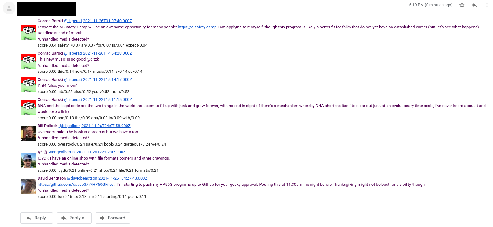

# spelunker

Scraping and data mining framework

I'm fond of Twitter and I'm grateful for being able to so easily learn from the world's greatest
hackers but I frequently get tired of having to wade through their less relevant tweets on
non-technical subjects.

Hence the intention here is to scrape news entries from a large number of sources (eg thousands of
Twitter handles' tweets) then use data mining techniques to sort the entries based on a dynamic,
user-defined interest.

The initial plan is to generate periodic emails (ie for use as a daily cronjob) then consider
building an interactive web application to more easily support modifying system parameters.

## Sources

Scraping is implemented using a custom Chrome DevTools interface.  System state (ie seen entries) is
maintained by a local SQLite database.

## Scoring

A custom score is calculated using entries' words
[TF-IDF](https://en.wikipedia.org/wiki/Tf%E2%80%93idf) and user-defined weights (to indicate
(dis)interest).

Word frequency across the (thus far seen) corpus is maintained by another local SQLite database.

## But in Lisp?!

Paul Graham's "Hackers and Painters" convinced me to (re)visit Lisp and I'm glad it did.
